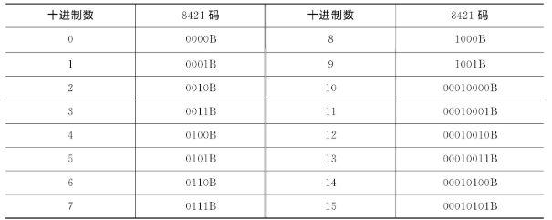
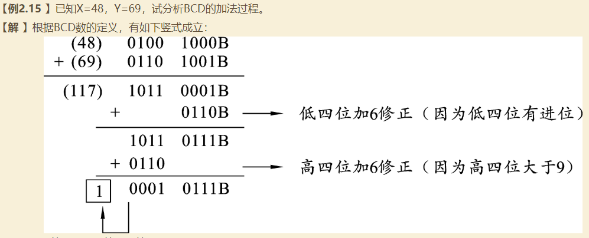
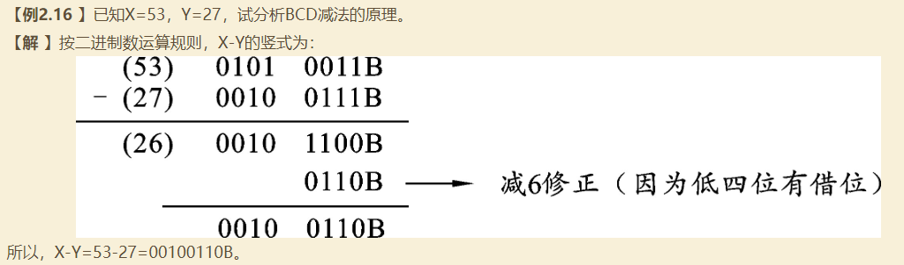

# 计算机编码

计算机对十进制数的处理过程是：键盘上输入的十进制数字先被替换成一个个ASCII码送入计算机，然后通过程序替换成BCD码，并对BCD码直接进行运算；也可以先把BCD码替换成二进制码进行运算，并把运算结果再变为BCD码，最后还要把BCD码形式的输出结果变换成ASCII码才能在屏幕上加以显示，这是因为BCD码形式的十进制数是不能直接在键盘/屏幕上输入/输出的。

汉字的编码方法通常分为两类：一类称为汉字输入法编码，例如五笔字型编码、拼音编码等，现已多达数百种；另一类是计算机内部对汉字处理时所用的二进制编码，通常称为机内码，如电报码、国标码和区位码等。

## 一、BCD码

Binary Coded Decimal，十进制数的二进制编码

BCD码是一种具有十进制权的二进制编码，称为十进制数的二进制编码。BCD码的种类较多，常用的有8421码、2421码、余3码和格雷码等。

### 1.1 8421码

8421码也是BCD码中的一种，因组成它的四位二进制数码的权为8、4、2、1而得名。8421码是一种采用四位二进制数来代表十进制数码的代码系统，在这个代码系统中，10组四位二进制数分别代表了0~9中的10个数字符号，如表2.2所示。

四位二进制数字共有16种组合，其中0000B至1001B为8421的基本代码系统，1010B至1111B未被使用，称为非法码或冗余码。10以上的所有十进制数至少需要两位8421码字（即八位二进制数字）来表示，而且不应出现非法码，否则就不是真正的BCD数。因此，BCD数是由BCD码构成的，是以二进制形式出现的，是逢十进位的，但它并不是一个真正的二进制数，因为二进制数是逢二进位的。例如：十进制数45的BCD形式为01000101B（即45H），而它的等值二进制数为00101101B（即2DH）。BCD编码表如下

### 1.2 BCD加法运算

所谓BCD加法是指两个BCD数按逢十进一原则相加，其和也是一个BCD数。BCD加法应由计算机自动完成，但计算机只能进行二进制加法，它在两个相邻BCD码之间只能按逢16进位，不可能进行逢十进位。因此，计算机进行BCD加法时，必须对二进制加法的结果进行修正，使两个紧邻的BCD码之间真正能够做到逢十进一。

在进行BCD加法运算过程中，计算机对二进制加法结果进行修正的原则是：若和的低四位大于9或低四位向高四位发生了进位，则低四位加6修正；若高四位大于9或高四位的最高位发生进位，则高四位加6修正。这种修正由微处理器内部的十进制调整电路自动完成。如：

### 1.3 BCD减法运算

与BCD加法运算类似，BCD减法运算中也要修正。在BCD减法运算过程中，若本位被减数大于减数（即低四位二进制数的最高位无借位），则减法是正确的；若本位被减数小于减数，则减法运算时就需要借位，由于BCD运算规则是借1当做10，二进制在两个BCD码间的运算规则是借1当做16，而机器是按二进制规则运算的，故必须进行减6修正。

在BCD减法运算过程中，计算机对二进制运算结果修正的原则是：若低四位大于9或低四位向高四位有借位，则低四位减6修正；若高四位大于9或高四位最高位有借位，则高四位减6修正。和BCD加法运算类似，这个修正也由机器内部的十进制调整电路自动完成。

## 二、ASCII码

American Standard Code for Information Interchange，美国信息交换标准码，字符编码

对键盘上输入字符的二进制编码，通常，ASCII码由七位二进制数码构成，共可为128个字符编码，这128个字符共分两类：一类是图形字符，共96个；另一类是控制字符，共32个。96个图形字符包括十进制数符10个、大小写英文字母52个以及其他字符34个，这类字符有特定形状，可以显示在显示器上或打印在打印纸上，其编码可以存储、传送和处理。32个控制字符包括回车符、换行符、退格符、设备控制符和信息分隔符等，这类字符没有特定形状，其编码虽然可以存储、传送和起某种控制作用，但字符本身是不能在显示器上显示或在打印机上打印的。

字符0~9所对应的ASCII码是在其数字的基础上加30H得到的。例如，字符9对应的ASCII码为30H+09H=39H；字符A所对应的ASCII码，是在其对应的十六进制数的基础上加37H，A在十六进制里面代表数字10，则有37H+0AH=41H。由于字符A至Z的ASCII码是顺序排列的，所以任意一个大写字母的ASCII码都能通过字符A的ASCII码计算出来。例如，字符Z所对应的ASCII码应比字符A所对应的ASCII码大25（19H），所以字符Z所对应的ASCII码为41H+19H=5AH。由于小写字母所对应的ASCII码比其大写字母所对应的ASCII码大32（20H），所以小写字母a所对应的ASCII码为41H+20H=61H。由于小写字母a至z所对应的ASCII码也是顺序排列的，所以任意一个小写字母的ASCII码也可参照字符a的ASCII码计算出来。

在八位微型计算机中，信息通常是按字节存储和传送的，一个字节有八位。ASCII码共有七位，用一个字节表示还多出一位。多出的这位是最高位，常常用做奇偶校验，故称为奇偶校验位。奇偶校验位在信息发送中用处很大，它可以用来校验信息传送过程是否有错。

## 三、国标码（汉字编码）：

国标码（GB 2312—1980）是《信息交换用汉字编码字符集（基本集）》的简称，是我国国家标准总局于1980年颁布的国家标准，编号为GB 2312—1980。

在国标码中，共收集汉字6 763个，分为两级。第一级收集汉字3 755个，按拼音排序。第二级收集汉字3 008个，按部首排序。除汉字外，该标准还收集一般字符201个（包括间隔符、标点符号、运算符号、单位符号和制表符等）、序号60个、数字22个、拉丁字母66个、汉语拼音符号26个、汉语注音字母37个等。因此，这张表很大，连同汉字一共是7 445个图形字符。

为了给7 445个图形字符编码，采用7位二进制编码显然是不够的。因此，国标码采用14位二进制来给7 445个图形字符编码。14位二进制中的高7位占一个字节（最高位不用），称为第一字节；低7位占另一个字节（最高位不用），称为第二字节。

国标码中的汉字和字符分为字符区和汉字区。21H至2FH（第一字节）和21H至7EH（第二字节）为字符区，用于存放非汉字图形字符；30H至7EH（第一字节）和21H至7EH（第二字节）为汉字区。在汉字区中，30H至57H（第一字节）和21H至7EH（第二字节）为一级汉字区；58H至77H（第一字节）和21H至7EH（第二字节）为二级汉字区，其余为空白区，可供使用者扩充。因此，国标码是采用四位十六进制数来表示一个汉字的。例如，“啊”的国标码为3021H（30H为第一字节，21H为第二字节），“厂”的国标码为3327H（33H为第一字节，27H为第二字节）。

## 四、区位码（汉字编码）：

其实区位码和国标码的区别并不大，它们共用一张编码表。国标码用4位十六进制数来表示一个汉字，区位码是用4位十进制区号和位号来表示一个汉字，只是在编码的表示形式上有所区别。具体来讲，区位码把国标码中第一字节的21H至7EH映射成1~94区，把第二字节的21H至7EH映射成1~94位。区位码中的区号决定对应汉字位于哪个区（每区94位，每位一个汉字），位号决定相应汉字的具体位置。例如，“啊”的区位码为1601（十进制），16是区号，01是位号；“厂”的区位码为1907（十进制），19是区号，07是位号。

国标码是计算机赖以处理汉字的最基本编码，区位码在输入过程中比较容易记忆。计算机最终还是要把区位码替换成国标码，替换方法是先把十进制形式的区号和位号替换成二进制形式，然后分别加上20H。例如，“啊”的区位码为1601，替换成十六进制形式为1001H，区号和位号分别加上20H后变为3021H。这就是“啊”的国标码。同理，“厂”的区位码为1907，国标码为3927H。

## 五、汉字机内码（汉字编码）：

国标码作为一种国家标准，是所有汉字编码都必须遵循的统一标准，但由于国标码每个字节的最高位都是“0”，与国际通用的标准ASCII码无法区分。例如，“天”字的国标码是01001100 01101100，这两个字节分别对应十六进制数的4CH、6CH。而英文字符“L”和“l”的ASCII码也恰好是4CH和6CH，因此，如果存储器中有连续两个字节4CH和6CH，就难以确定到底是汉字“天”字，还是英文字符“L”和“l”。显然，国标码必须进行某种变换才能在计算机内部使用。因此，我国的做法是将每个汉字所对应的国标码的两个字节的最高位分别设定为1，作为该字的机内码。例如汉字“天”的机内码就是11001100 11101100，写成十六进制数是CCH ECH。