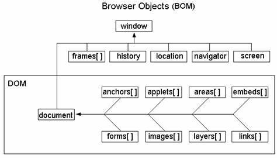

# JavaScript

通俗来讲就是给html文件中的标签（节点）进行增删改查

## 一、HTML 中嵌入 JS 的三种方式

1.1 直接在标签中写

1.2 在 HTML 文件的 \<head> 或  \<body> 标签中中写

1.3 通过 .JS 文件写

```html
<body>
    <script type="text/javascript" src=".js路径"></script>
</body>
```

## 二、JavaScript 包括三块

- ECMAScript 
- 浏览器对象模型（Brower Object Model，BOM）
- 文档对象模型（Document Object Model，DOM）
  

