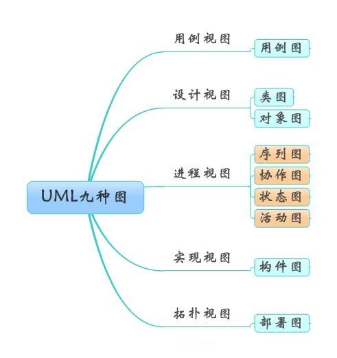
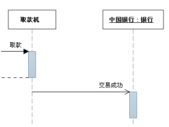
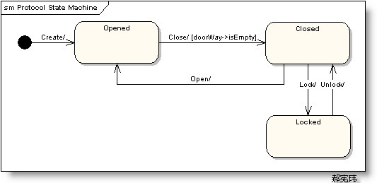

# 图

## 图的分类

分类方法一：

分类方法二：

静态图：用例图，类图，对象图，包图，构件图，部署图。

动态图：序列图，协作图，状态图，活动图。

## 一、用例图（UseCase Diagrams）

用例图主要回答了两个问题：

- - 是谁用软件。
  - 软件的功能。

从用户的角度描述了系统的功能，并指出各个功能的执行者，强调用户的使用者，系统为执行者完成哪些功能。

## 二、类图（Class Diagrams）：

用户根据用例图抽象成类，描述类的内部结构和类与类之间的关系，是一种静态结构图。     

表示方法：

- 属性（Attribute）的表示方法：可见性符号 名称 : 类型=初始值
- 操作（Operation）的表示方法：可见性符号 名称(参数列表) : 返回值类型
- 可见性符号：
  - \+ ：表示public
  - \- ：表示private
  - \#：表示protected（friendly也归入这类）

## 三、对象图（Object Diagrams）

描述的是参与交互的各个对象在交互过程中某一时刻的状态。对象图可以被看作是类图在某一时刻的实例。

## 四、序列图（Sequence Diagrams）

### 定义

交互图的一种，描述了对象之间消息发送的先后顺序，强调时间顺序。序列图的主要用途是把用例表达的需求，转化为进一步、更加正式层次的精细表达。用例常常被细化为一个或者更多的序列图。同时序列图更有效地描述如何分配各个类的职责以及各类具有相应职责的原因。

消息用从一个对象的生命线到另一个对象生命线的箭头表示。箭头以时间顺序在图中从上到下排列。

### 序列图中涉及的元素

- 生命线：生命线名称可带下划线。当使用下划线时，意味着序列图中的生命线代表一个类的特定实例。
  
- 同步消息：同步等待消息
  
- 异步消息：异步发送消息，不需等待
  
- 注释
  
- 约束
  
- 组合

## 五、协作图

 交互图的一种，描述了收发消息的对象的组织关系，强调对象之间的合作关系。时序图按照时间顺序布图，而写作图按照空间结构布图

## 六、状态图（Statechart Diagrams）

是一种由状态、变迁、事件和活动组成的状态机，用来描述类的对象所有可能的状态以及时间发生时状态的转移条件。

## 七、活动图

是状态图的一种特殊情况，这些状态大都处于活动状态。本质是一种流程图，它描述了活动到活动的控制流。交互图强调的是对象到对象的控制流，而活动图则强调的是从活动到活动的控制流。活动图是一种表述过程基理、业务过程以及工作流的技术。它可以用来对业务过程、工作流建模，也可以对用例实现甚至是程序实现来建模。

### 带泳道的活动图

泳道表明每个活动是由哪些人或哪些部门负责完成。

### 带对象流的活动图

用活动图描述某个对象时，可以把涉及到的对象放置在活动图中，并用一个依赖将其连接到进行创建、修改和撤销的动作状态或者活动状态上，对象的这种使用方法就构成了对象流。对象流用带有箭头的虚线表示。

## 八、构件图（Component Diagrams）

构件图是用来表示系统中构件与构件之间，类或接口与构件之间的关系图。其中，构建图之间的关系表现为依赖关系，定义的类或接口与类之间的关系表现为依赖关系或实现关系。

## 九、部署图（Deployment Diagrams）

描述了系统运行时进行处理的结点以及在结点上活动的构件的配置。强调了物理设备以及之间的连接关系

部署模型的目的：描述一个具体应用的主要部署结构，通过对各种硬件，在硬件中的软件以及各种连接协议的显示，可以很好的描述系统是如何部署的；平衡系统运行时的计算资源分布；可以通过连接描述组织的硬件网络结构或者是嵌入式系统等具有多种硬件和软件相关的系统运行模型。

