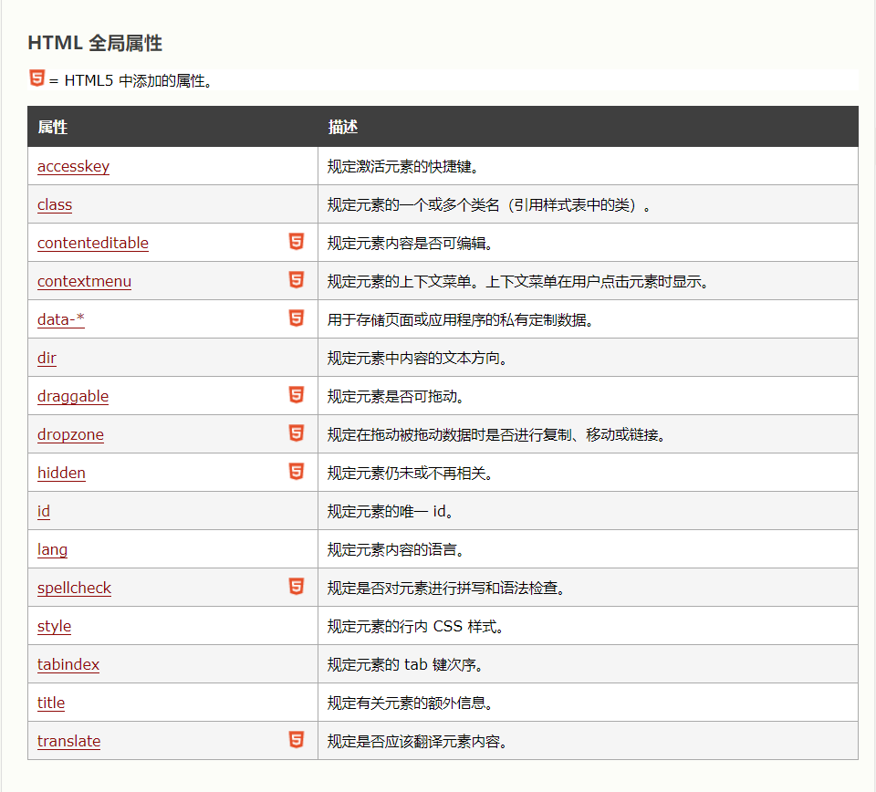

# 属性

## 一、HTML 全局属性



## 一、背景颜色

style 属性淘汰了“旧的” bgcolor 属性。

<body style="background-color:yellow">主体</body>

## 二、字体

style 属性淘汰了旧的 <font> 标签。

```html
<h1 style="font-family:verdana">标题1</h1>
```

## 三、颜色

```html
<p style="font-family:arial;color:red;font-size:20px;">段落</p>
```

## 四、尺寸：

style 属性淘汰了旧的 <font> 标签。

```html
<p style="font-family:arial;color:red;font-size:20px;">段落</p>
```

## 五、文本对齐：

style 属性淘汰了旧的 "align" 属性。

```html
<h1 style="text-align:center">标题1</h1>
```

